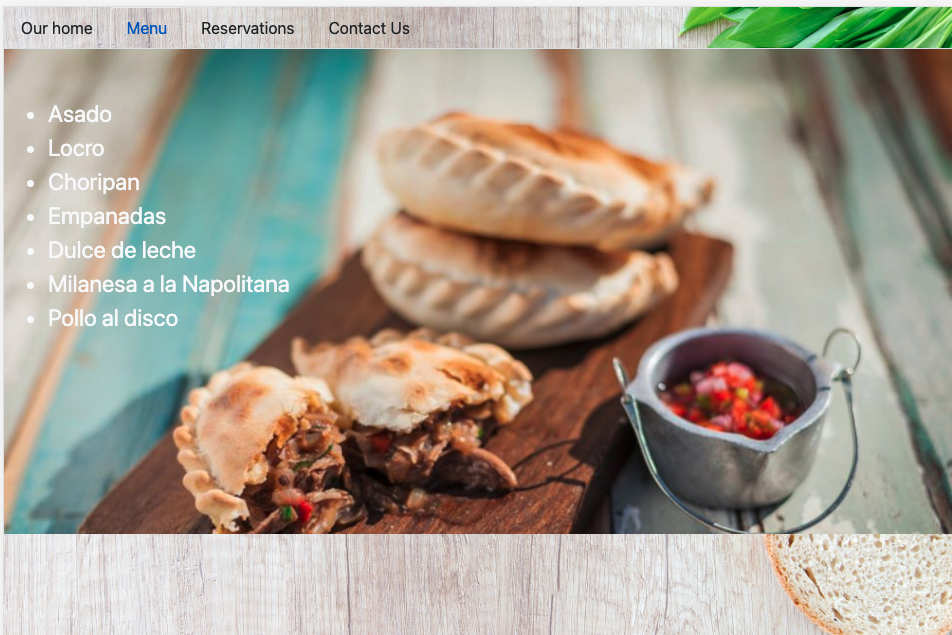

## Project: Restaurant Page

## Features

- All the elements in the DOM are added using Javascript

## Screenshots

## Built With

- HTML5
- CSS3
- Javascript (ES6)

## Live Demo

Visit the [Restaurant Page](https://miguelargentina.github.io/restaurant-page/)

## Prerequisites
- Internet browser compatible with HTML5, CSS3 and Javascript ES6

## Getting Started

- Open your terminal - Windows: `Win + R`, then type `cmd` | Mac: `Command + space`, then type `Terminal`
- Navigate to a directory of your choosing using the `cd` command
- Run this command in your OS terminal: `git clone git@github.com:MiguelArgentina/restaurant-page.git` to get a copy of the project.
- Navigate to the project's directory using the `cd` command
- Run `npx run start` to start the server
-

### Usage

- On your broser, go to [http://localhost:8080/](http://localhost:8080/) to visit the site

## Author

👤  &nbsp; **Miguel Ricardo Gomez**
- GitHub: [@MiguelArgentina](https://github.com/MiguelArgentina)
- Twitter: [@Qete_arg](https://twitter.com/Qete_arg)
- LinkedIn: [Miguel Ricardo Gomez](https://www.linkedin.com/in/miguelricardogomez/)

## Show your support

Give a &nbsp; ⭐️  &nbsp; if you like this project!

## Acknowledgments

This project was based on this [The Odin Project](https://www.theodinproject.com/paths/full-stack-javascript/courses/javascript/lessons/restaurant-page) lesson
